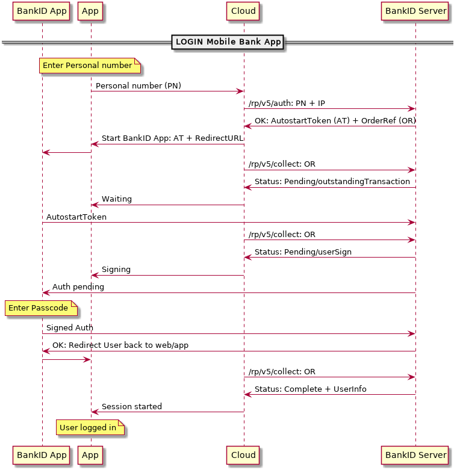

# BankID API

This little module helps with BankID integrations.

## Authentication flow



Example in the `./example/` directory demonstrates using the BankID app on another device.

```golang
package main

import (
    "fmt"
    "log"
    "os"
    "time"

    "github.com/jfernstad/bankid"
)

func main() {

    // Let's use the official messages
    // for events and errors, in English
    p, _ := bankid.NewMessages("en")

    caTestPath := "../CA/test.crt"
    rpCrtPath := "../rp/bankid_rp_test.crt" // NOTE: Replace with your RP (Relaying Partner) certificate
    rpKeyPath := "../rp/bankid_rp_test.key" // NOTE: Replace with your RP key

    // bankid.TestBaseURL or bankid.ProductionBaseURL
    env, err := bankid.NewEnvironment(bankid.TestBaseURL, caTestPath, rpCrtPath, rpKeyPath)
    if err != nil {
        log.Printf(" !! Could not create TestEnvironment: %s", err.Error())
        os.Exit(1)
    }

    // Remove non-digits from personal number
    personalNumber := "198001010109" // NOTE: Replace with a real personal number
    ipAddr := "127.0.0.1"            // IP of your mobile phone with BankID app on it

    // Print message as instructed by the RP Guidelines v3.2.2
    fmt.Println(" >> " + p.Msg(bankid.RFA19))

    rsp, err := bankid.Auth(env, personalNumber, ipAddr)
    if err != nil {
        log.Printf(" !! Could not connect to server: %s\n", err.Error())
        os.Exit(1)
    }

    // Auth started!
    // Pull out your BankID app and sign the Auth request
    collectResponse := &bankid.CollectResponse{}
    done := false
    for !done {
        collectResponse, err = bankid.Collect(env, rsp.OrderRef)
        if err != nil {
            log.Printf(" !! Could not collect: %s\n", err.Error())
            os.Exit(1)
        }

        switch collectResponse.Status {
        case bankid.OrderPending:
            switch collectResponse.HintCode {
            case bankid.PendOutstandingTransaction:
                {
                    fmt.Println(" >> " + p.Msg(bankid.RFA1))
                }
            case bankid.PendNoClient:
                {
                    fmt.Println(" >> " + p.Msg(bankid.RFA1))
                }
            case bankid.PendStarted:
                {
                    fmt.Println(" >> " + p.Msg(bankid.RFA14_B))
                }
            case bankid.PendUserSign:
                {
                    fmt.Println(" >> " + p.Msg(bankid.RFA9))
                }
            }
        case bankid.OrderFailed:
            {
                done = true
                switch collectResponse.HintCode {
                case bankid.FailCancelled:
                    {
                        fmt.Println(" >> " + p.Msg(bankid.RFA3))
                        break
                    }
                case bankid.FailUserCancel:
                    {
                        fmt.Println(" >> " + p.Msg(bankid.RFA6))
                        break
                    }
                case bankid.FailExpiredTransaction:
                    {
                        fmt.Println(" >> " + p.Msg(bankid.RFA8))
                        break
                    }
                }
            }
        case bankid.OrderComplete:
            {
                done = true
                log.Println(" >> 😎 Auth Complete ")
                log.Printf(" >> %s signed in!\n", collectResponse.CompletionData.User.Name)
                break
            }
        }
        // Don't spam the service plz
        time.Sleep(2 * time.Second)
    }

    // Just to demonstrate cancelling, we'll probably never end up here.
    if collectResponse.Status == bankid.OrderPending {
        err = bankid.Cancel(env, rsp.OrderRef)
        if err != nil {
            log.Printf(" !! Could not cancel request: %s\n", err.Error())
        }
        log.Printf(" >> Auth cancelled\n")
    }
}

```

For signing data, use the `bankid.Sign()` method instead of the `bankid.Auth()` method. The flow is the same. 

## License

MIT License
Copyright (c) 2019 Joakim Fernstad

Permission is hereby granted, free of charge, to any person obtaining a copy
of this software and associated documentation files (the "Software"), to deal
in the Software without restriction, including without limitation the rights
to use, copy, modify, merge, publish, distribute, sublicense, and/or sell
copies of the Software, and to permit persons to whom the Software is
furnished to do so, subject to the following conditions:

The above copyright notice and this permission notice shall be included in all
copies or substantial portions of the Software.

THE SOFTWARE IS PROVIDED "AS IS", WITHOUT WARRANTY OF ANY KIND, EXPRESS OR
IMPLIED, INCLUDING BUT NOT LIMITED TO THE WARRANTIES OF MERCHANTABILITY,
FITNESS FOR A PARTICULAR PURPOSE AND NONINFRINGEMENT. IN NO EVENT SHALL THE
AUTHORS OR COPYRIGHT HOLDERS BE LIABLE FOR ANY CLAIM, DAMAGES OR OTHER
LIABILITY, WHETHER IN AN ACTION OF CONTRACT, TORT OR OTHERWISE, ARISING FROM,
OUT OF OR IN CONNECTION WITH THE SOFTWARE OR THE USE OR OTHER DEALINGS IN THE
SOFTWARE.